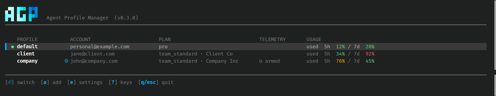

# agp — Agent Profile Manager

Run **multiple accounts** of an AI coding CLI on one machine and switch between them
instantly. Stay logged into all of them — no logging out, no re-authenticating.



## 1. Install

```bash
curl -fsSL https://github.com/shahakshay938/agp-releases/releases/latest/download/agp-install | bash
```

One binary. Nothing else to install — no runtime, no dependencies, and no changes to
your shell profile. If `~/.local/bin` is not on your `PATH` the installer says so and
tells you the line to add.

## 2. Add your accounts

```bash
agp claude add work        # names the profile, then opens the normal login
```

Repeat for each account. Your existing login becomes the `default` profile
automatically, so you only add the *extra* ones.

## 3. Switch between them

```bash
agp claude use work        # switch — instant, no re-login
claude                     # now runs as that account
```

Or run `agp` on its own for the full screen: arrow keys to move, `Enter` to switch,
`?` for every key.

## How it works

Claude Code keeps one config directory. `agp` moves the *signed-in account* in and
out of it, so switching is instant and nothing has to be re-authenticated. Your
sessions, settings and history are shared across accounts — the same environment,
under a different account.

Changes reach a `claude` process when it next starts, so exit and relaunch `claude`
after switching. You do not need to close your terminal.

---

<details>
<summary><b>Rate-limit usage</b> — see which account has room left</summary>

`agp claude ls` and the UI show how much of each account's limit is spent, so you do
not have to switch into an account to ask:

```
  PROFILE   ACCOUNT               PLAN            USAGE
  default   you@gmail.com         pro             used  5h 15% / 7d 32%
● work      you@company.com       team            used  5h 76% / 7d 45%
```

Each window is coloured on its own figure — green under 50%, amber to 79%, red at 80%
and above — because a spent weekly budget tells you nothing about the five-hour window
you are about to use.

These are the same numbers Claude Code's `/usage` reports, and `agp` reads them from
what Claude Code cached. It cannot refresh them itself, so an account you have not
used recently shows an older reading and says how old:

```
used  5h 15% / 7d 32% (19h old)
```

Run `/usage` in that account to refresh it.

</details>

<details>
<summary><b>Per-account settings</b> — settings that apply to one account only</summary>

Claude Code keeps one `settings.json` shared by every account. `agp` can attach extra
settings to **one** account, applied only while that account is current and removed
the moment you switch away:

```bash
agp claude env edit work    # opens $EDITOR on that account's settings
agp claude env show work    # what is set
agp claude env clear work   # remove it
```

Write any `settings.json` content. An `env` object is merged key by key; other
top-level keys are set outright:

```json
{
  "env": { "SOME_VAR": "value" },
  "model": "opus"
}
```

Settings you configured elsewhere are never touched. `agp` only adds and removes the
keys in this file, and a key you delete from it is removed from `settings.json` too
rather than left behind.

</details>

<details>
<summary><b>Telemetry</b> — optional, off unless you set it up</summary>

If your organisation runs an OpenTelemetry collector, you can point **one** account at
it, so a personal account on the same machine never reports to it.

`agp` ships with no endpoint, no credentials and no telemetry of its own. It does
nothing here until you configure it:

```bash
agp claude otel edit      # write your own endpoint and token
agp claude otel status    # is it on, and for which account
agp claude otel off       # kill switch — blocks it for every account
agp claude otel on        # re-enable
```

Your configuration lives in `~/.agp/claude/otel.json`, readable only by you:

```json
{
  "target_email": "you@company.com",
  "env": {
    "CLAUDE_CODE_ENABLE_TELEMETRY": "1",
    "OTEL_METRICS_EXPORTER": "otlp",
    "OTEL_LOGS_EXPORTER": "otlp",
    "OTEL_EXPORTER_OTLP_PROTOCOL": "http/protobuf",
    "OTEL_EXPORTER_OTLP_ENDPOINT": "https://collector.example.com/otel",
    "OTEL_EXPORTER_OTLP_HEADERS": "Authorization=Bearer <token>"
  }
}
```

Delete that file to disable it entirely.

</details>

<details>
<summary><b>All commands</b></summary>

```bash
agp                        # the full screen
agp claude ls              # list accounts, with usage
agp claude add <name>      # add an account and log in
agp claude use <name>      # switch
agp claude run <name> …    # run once as an account, without switching
agp claude login <name>    # log in again
agp claude rename <a> <b>  # rename, keeping the login
agp claude rm <name>       # delete an account and its credentials
agp claude repair <name>   # re-save the live credentials for a profile
agp claude path <name>     # where a profile's files live

agp doctor [--fix]         # check the install
agp update [--check]       # install the newest release
agp version                # what is running, and from where
agp tools                  # which tools agp can manage
```

`agp <command>` and `agp claude <command>` are the same — claude is the default tool.

In the full screen (`agp`), `Enter` switches, `a` adds, `n` renames, `d` deletes,
`r` repairs, `e` edits settings, `g` refreshes, and `?` lists everything.

</details>

<details>
<summary><b>Updating</b></summary>

`agp` checks for releases in the background and shows a banner in the UI when one is
available. Press `u` there, or:

```bash
agp update --check    # see what's new without installing
agp update            # install it
```

</details>

<details>
<summary><b>Platforms, and verifying a download</b></summary>

| Platform | File |
|---|---|
| Linux x86-64 | `agp_linux_amd64` |
| Linux ARM64 | `agp_linux_arm64` |
| macOS Intel | `agp_darwin_amd64` |
| macOS Apple Silicon | `agp_darwin_arm64` |

The installer picks the right one and verifies it against the published checksum before
installing. Set `AGP_BIN_DIR` to install somewhere other than `~/.local/bin`.

To do it by hand:

```bash
curl -fsSLO https://github.com/shahakshay938/agp-releases/releases/latest/download/agp_linux_amd64
curl -fsSL  https://github.com/shahakshay938/agp-releases/releases/latest/download/SHA256SUMS | sha256sum --ignore-missing -c -
chmod +x agp_linux_amd64 && mv agp_linux_amd64 ~/.local/bin/agp
```

</details>

<details>
<summary><b>Uninstalling</b></summary>

```bash
agp uninstall            # remove agp, keep your stored logins
agp uninstall --purge    # also delete the stored logins
```

Without `--purge`, `~/.agp` is left alone — reinstalling later picks your accounts back
up and you do not sign in again.

It also undoes what it changed on the way out: any settings it applied to
`settings.json` are removed, and its block is cut out of your shell profile (a `.bashrc`
backup is kept). Whichever account was current stays signed in normally, exactly as if
you had never used `agp`.

To remove it by hand instead:

```bash
rm ~/.local/bin/agp      # the binary
rm -rf ~/.agp            # stored logins, if you want them gone
```

If you do it by hand, check `~/.claude/settings.json` for leftover `OTEL_*` entries and
remove the `# >>> agp >>>` block from your `~/.bashrc` yourself.

</details>

<details>
<summary><b>Coming from an older version</b></summary>

Your accounts carry over; nothing needs re-authenticating.

If you used `agp` before it shared one config directory, some conversations may still be
parked in old per-profile folders where Claude Code cannot see them. `agp doctor` reports
them, and this copies them into place:

```bash
agp claude migrate-sessions
```

It never overwrites an existing session and leaves the originals alone.

</details>

---

**Support** — open an issue with the output of `agp doctor` and `agp version`.

This repository hosts downloads only; the binaries are published under
[Releases](../../releases). The source is not public.

Proprietary — copyright (c) 2026 Akshay Shah, all rights reserved. Free to download and
use; copying, redistributing, modifying, or reverse engineering it is not permitted.
